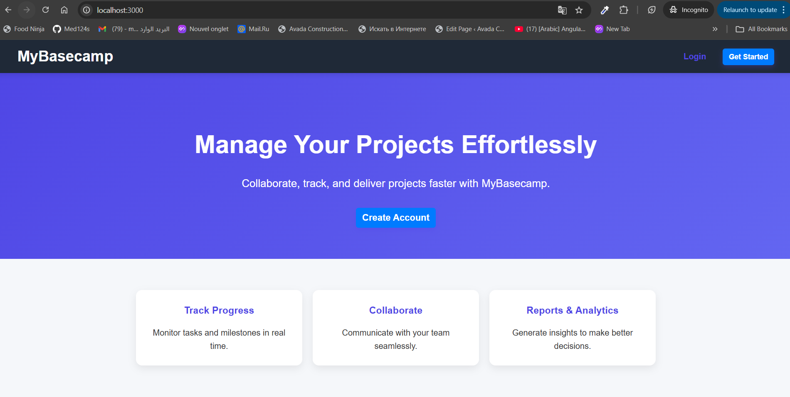
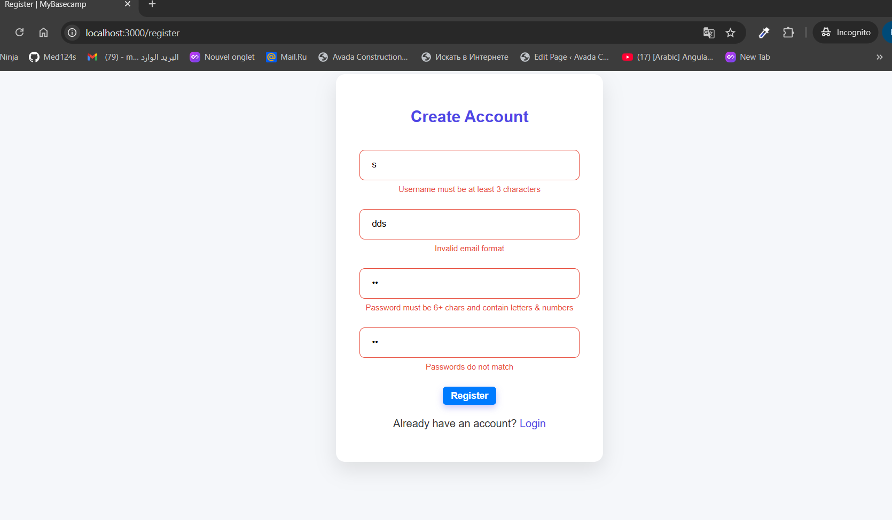
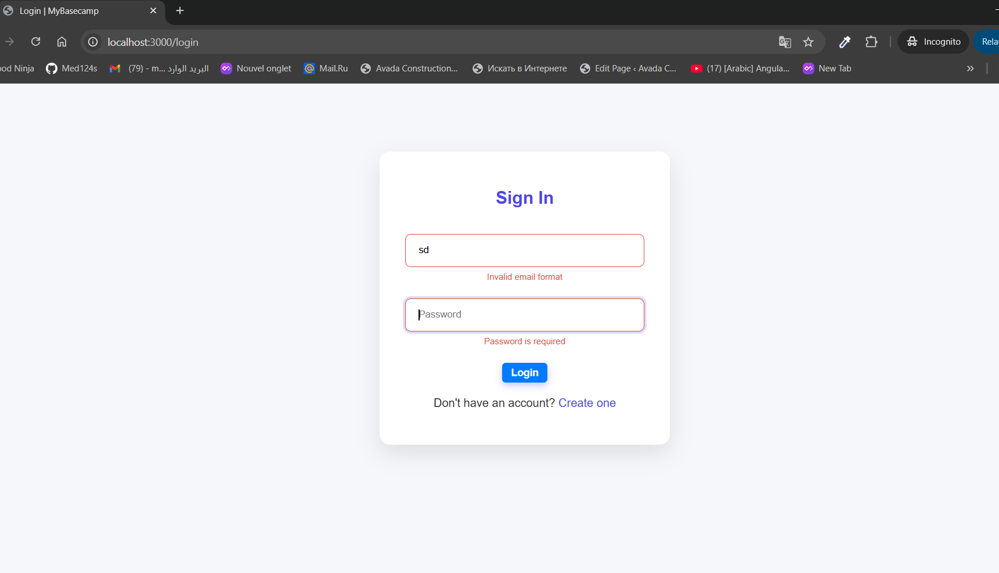
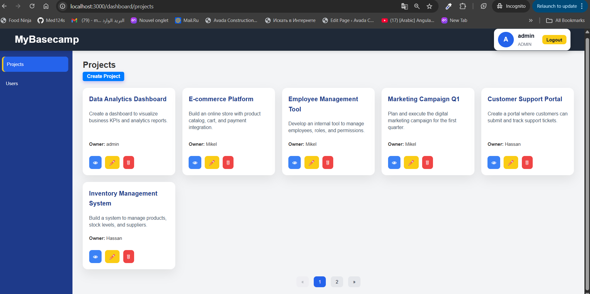
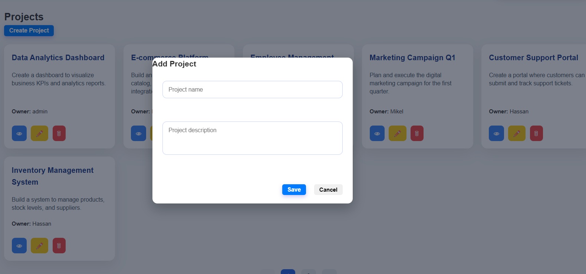
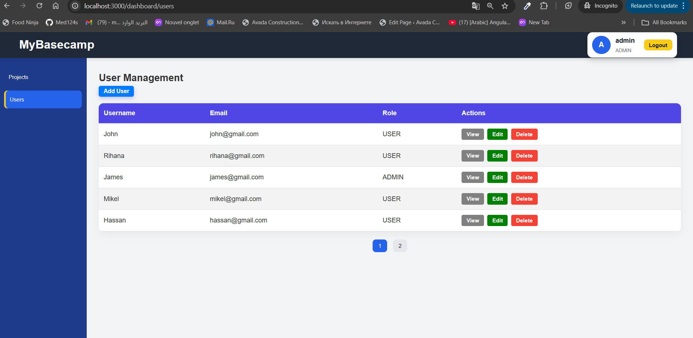
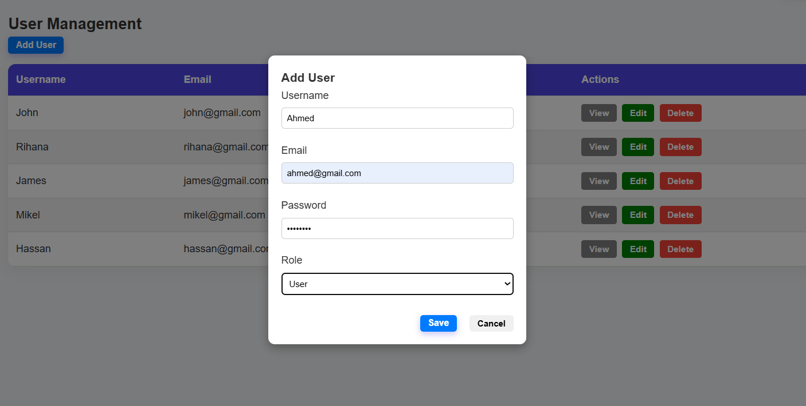
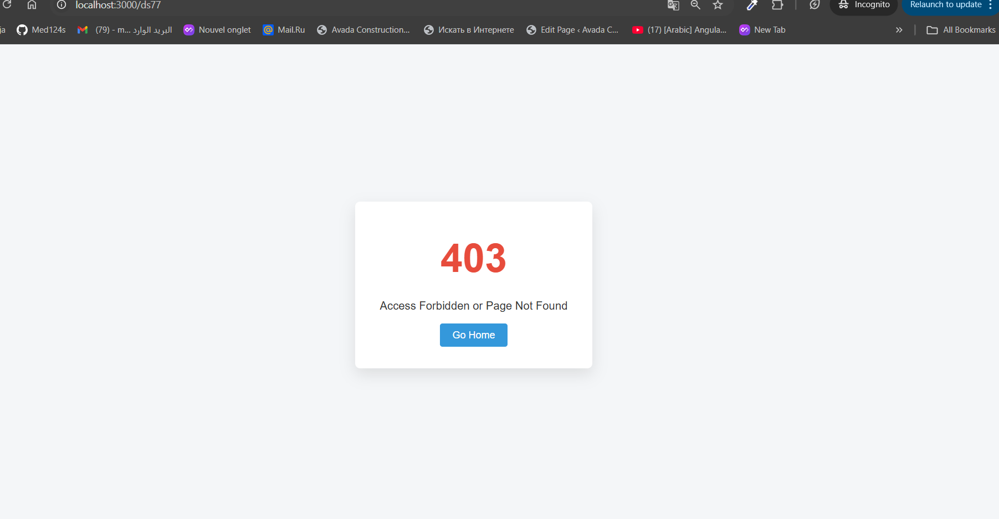

# Welcome to My Basecamp 1

---

## Task

The goal of My Basecamp 1 is to build a web-based project management tool inspired by Basecamp.
Users should be able to:
Register and log in.

Create, view, edit, and delete projects.

Have role-based permissions (regular user vs admin).

Admin users can manage other users.

The challenge is to implement full-stack functionality (frontend + backend + database) with user experience and proper validation.

## Description

**Solution**
This project is a web-based project management application called **MyBasecamp**, featuring both frontend and backend components.
**Frontend:**

- Built with **HTML, CSS, and JavaScript**.
- Dynamic **modals** for creating and editing projects and users.
- **Form validation** on registration, login, and CRUD forms.
- **Alerts and confirmation dialogs** for delete actions.
- Pagination for projects and users.

**Backend:**

- Developed with **Node.js** and **Express.js**.
- Provides a **REST API** for authentication, users, and project management.
- Implements **role-based access control**: only admins can manage users.
- Authentication via **session-based login**.
- Database interactions handled with **Sequelize ORM** and **SQLite**.
  **Key Features:**
- User registration and login with secure password hashing.
- Admins can **create, update, view, and delete users**.
- Users can **create and manage their own projects**, while admins can manage all projects.
- Real-time feedback on form inputs with error messages displayed below each input.
- Responsive UI with intuitive navigation and sidebar access based on user roles.



### Core Features Implemented

1. **User Authentication System**

   - Secure registration with password validation
   - Login/logout functionality with session management
   - Password encryption using BCrypt
   - Email uniqueness validation

2. **Project Management**

   - Create, read, update, and delete projects
   - Project ownership and access control
   - Project assignments
   - Pagination support for project listings

3. **User Profile Management**

   - Security settings page

4. **Administrative Dashboard**

   - Role-based access control (admin vs regular users)
   - Self-demotion prevention for admins

5. **Database Design**

   - **Users Table**: stores user information including `username`, `email`, `password` (hashed), and `role` (ADMIN or USER) for role-based access control.
   - **Projects Table**: stores project information including `name`, `description`, and `ownerId` (foreign key referencing `Users.id`) to track project ownership.
   - **Associations & Constraints**:
     - One-to-many relationship: a user can have many projects (`User.hasMany(Project)`).
     - Each project belongs to a user (`Project.belongsTo(User)`).
     - Proper foreign key constraints are set to maintain referential integrity.
     - Cascading deletes: deleting a user automatically removes their associated projects.

6. **User Experience Enhancements**
   - Responsive design with custom CSS
   - JavaScript-enhanced interactions (dropdowns, password strength)
   - Clean and intuitive navigation

## Installation

**How to install your project?**

Follow these steps to set up MyBaseCamp1 on your local machine:

### Step 1: Clone the Repository

```bash
# My Git (Mohamed Ben-yghil)
git clone https://github.com/Med124s/My_Basecamp1_Quassar?tab=readme-ov-file

# Qwasar Git
git clone https://git.us.qwasar.io/my_basecamp_1_200773_9nmm6_/my_basecamp_1

cd ./my_basecamp_1
```

### Step 2: Install Dependencies

```bash
npm install
```

### Step 3: Start the Application

```bash
node server.js
```

# The application will be available at `http://localhost:3000`

## Usage

**How does it work?**

### Application Workflow

1. **First-Time Setup**

   - Navigate to `http://localhost:3000`
   - Click "Register" to create a new account
   - Fill in username, email, and password (minimum 6 characters)
   - Submit to create your account

   

   **OR**
   if you will use the provided data

   - use the following credentials:

   #### Admin User

   - email: admin@admin.com
   - password: "admin123"

   #### User

   - email: user@user.com
   - password: "user123"

   

2. **Projects Dashboard**

   

   - After login, you'll see your projects dashboard
   - View all projects you own or are assigned to
   - Projects are paginated

3. **Creating Projects**
   

   - Click "New Project" button
   - Fill in project details:
     - Name (required)
     - Description
   - Submit to create the project

4. **Managing Projects**
   
   
   

   - Click on any project to view details
   - Edit project information and assignments
   - Delete projects (owners and admins only)

5. **Managing Users**
   
   

- Only **admins** can access the Users section and perform CRUD operations.
- Admins can:
  - View the list of all users.
  - Create new users with a specific role (ADMIN or USER).
  - Edit user information (username, email, role, password).
  - Delete users if necessary.
- Normal users **cannot access the Users section** and will see a "Forbidden" page if they try.
- Each user can be assigned to projects as an owner. Only the **owner of a project or an admin** can edit or delete that project.



### API Endpoints Structure

```
Authentication:
  POST /auth/login              - Registration page
  GET  /auth/me                 - Process login
  POST /auth/register           - Rregistration
  POST /auth/logout             - Logout user

Projects:
  GET    /api/projects         - List all projects
  GET    /api/projects/:id     - View project details
  PUT    /api/projects/:id     - Update project
  POST   /api/projects         - Create project
  DELETE /api/projects/:id     - Delete project

Admin:/ Users Management (Role-Based, Admin Only):**
  GET  /api/users                  - List users
  POST /api/users                  - Create user
  GET  /api/users/:id              - View user
  PUT  /api/users/:id              - Update user
  DELETE  /api/users/:id           - Delete user
```

**Notes / Rules:**
- Only **admins** can access `/api/users` endpoints.
- Normal users cannot access the Users section; trying to do so returns `403 Forbidden`.
- Every project has an **owner** (the user who created it).
- Only the **owner** or an **admin** can edit or delete a project.
- All API responses use JSON.


### The Core Team

<span><i>Made at <a href='https://qwasar.io'>Qwasar SV -- Software Engineering School</a></i></span>
<span></span>
