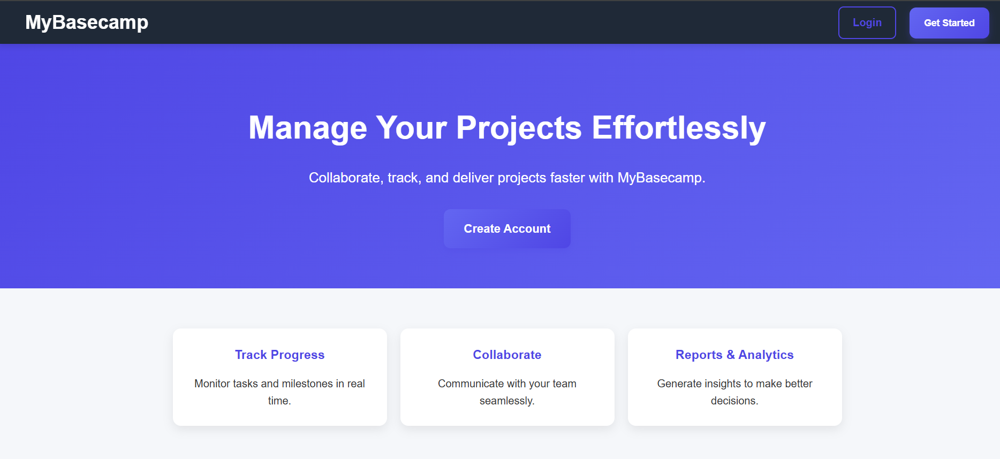
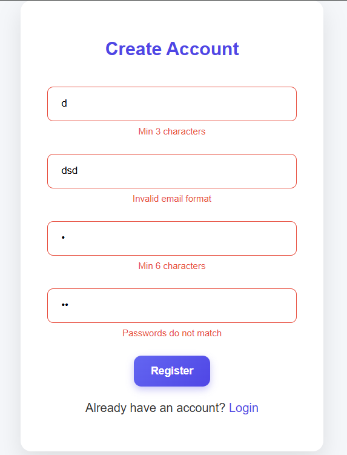
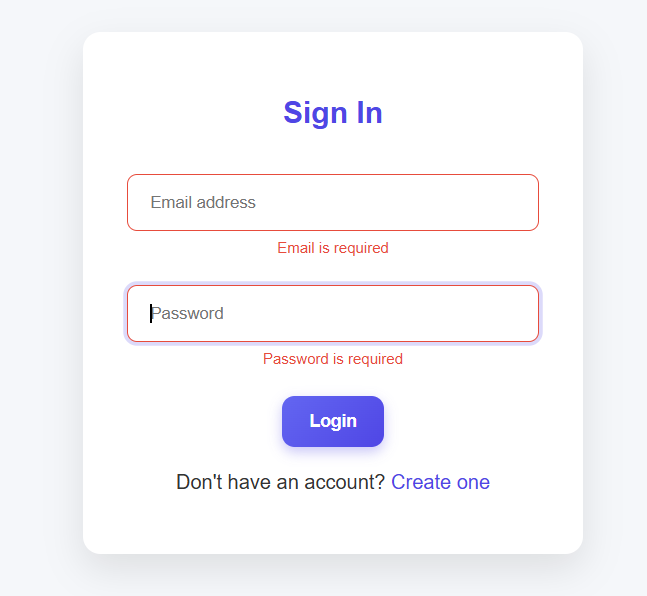
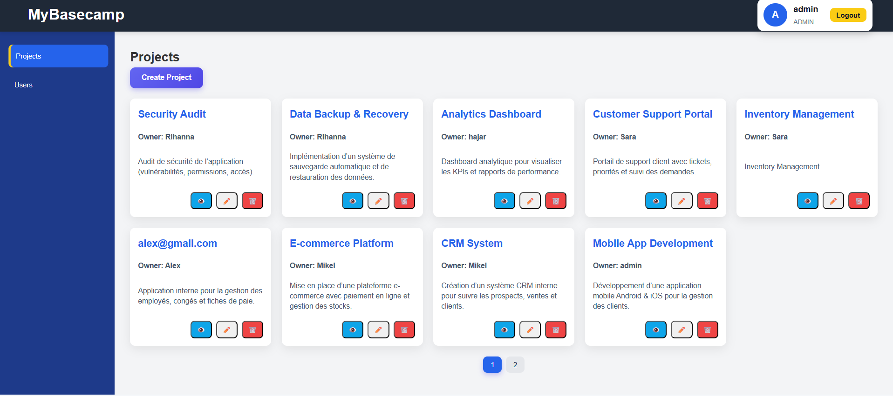
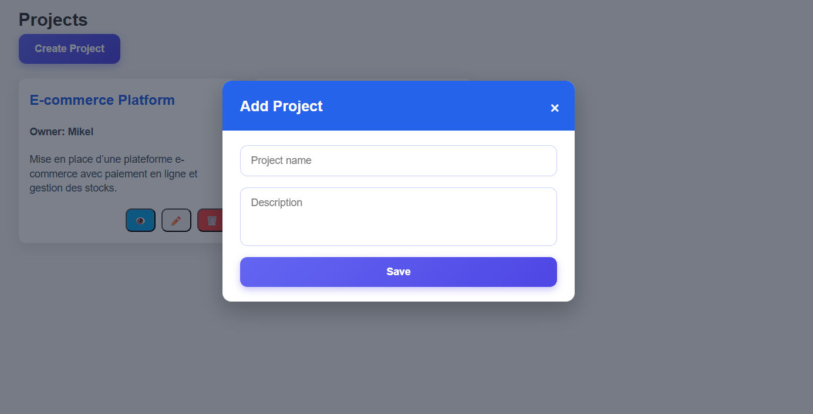
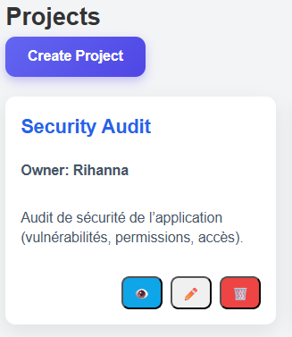
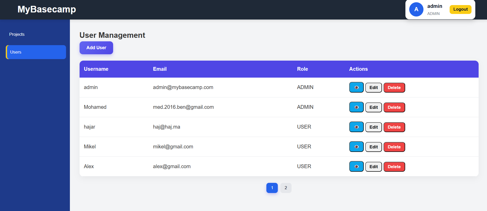

# Welcome to My Basecamp 1
---

## Task

The goal of My Basecamp 1 is to build a web-based project management tool inspired by Basecamp.
Users should be able to:
Register and log in.

Create, view, edit, and delete projects.

Have role-based permissions (regular user vs admin).

Admin users can manage other users.

The challenge is to implement full-stack functionality (frontend + backend + database) with user experience and proper validation.

## Description

**Solution**
Frontend: HTML, CSS, and JavaScript (modals, forms, validation).
Backend: Node.js + Express.js REST API for authentication, users, and projects.
Database: MongoDB or PostgreSQL for storing users and projects.
Authentication & Authorization: JWT or session-based; role-based access for admins.
UX Features:
Modals for project creation/editing.
Alerts and confirmation messages for delete actions.
Input validation on login and registration forms.
Pagination for projects.



### Core Features Implemented

1. **User Authentication System**

   - Secure registration with password validation (minimum 6 characters)
   - Login/logout functionality with session management
   - Password encryption using BCrypt
   - Email uniqueness validation

2. **Project Management**

   - Create, read, update, and delete projects
   - Project ownership and access control
   - Project assignments
   - Pagination support for project listings

3. **User Profile Management**
   - Security settings page

4. **Administrative Dashboard**
   - Role-based access control (admin vs regular users)
   - Self-demotion prevention for admins
5. **Database Design**
   - Users table with secure authentication
   - Projects table with ownership tracking
   - Proper foreign key relationships and cascading deletes

6. **User Experience Enhancements**
   - Responsive design with custom CSS
   - JavaScript-enhanced interactions (dropdowns, password strength)
   - Clean and intuitive navigation

## Installation

**How to install your project?**

Follow these steps to set up MyBaseCamp1 on your local machine:

### Step 1: Clone the Repository

```bash
# Qwasar Git
git clone https://git.us.qwasar.io/my_basecamp_1_200773_9nmm6_/my_basecamp_1

cd ./my_basecamp_1
```
### Step 2: Install Dependencies

```bash
npm install
```

### Step 3: Start the Application

```bash
node server.js
```

# The application will be available at `http://localhost:3000`

## Usage

**How does it work?**

### Application Workflow

1. **First-Time Setup**

   - Navigate to `http://localhost:3000`
   - Click "Register" to create a new account
   - Fill in username, email, and password (minimum 6 characters)
   - Submit to create your account

   

   **OR**
   if you will use the provided data

   - use the following credentials:

   #### Admin User
   - email: admin@mybasecamp.com
   - password: "admin123"

   

2. **Admin Dashboard**

   

   - After login, you'll see your projects dashboard
   - View all projects you own or are assigned to
   - Projects are paginated (9 per page by default)

3. **Creating Projects**
   

   - Click "New Project" button
   - Fill in project details:
     - Name (required)
     - Description
   - Submit to create the project

4. **Managing Projects**

    
   - Click on any project to view details
   - Edit project information and assignments
   - Delete projects (owners and admins only)

5. **Admin Features** (Admin users only)


- Access admin dashboard 
- Manage all users
- Promote/demote user roles
  

### API Endpoints Structure
```
Authentication:
  POST /auth/login              - Registration page
  GET  /auth/me                 - Process login
  POST /register                - Rregistration
  POST /auth/logout             - Logout user

Projects:
  GET    /projects         - List all projects
  GET    /projects/:id     - View project details
  PUT    /projects/:id     - Update project
  POST   /projects         - Create project
  DELETE /projects/:id     - Delete project

Admin:
  GET  /admin/users                  - List users
  GET  /admin/users/new              - New user form
  POST /admin/users                  - Create user
  GET  /admin/users/:id              - View user
  GET  /admin/users/:id/edit         - Edit user form
  PUT  /admin/users/:id              - Update user
```

### The Core Team

<span><i>Made at <a href='https://qwasar.io'>Qwasar SV -- Software Engineering School</a></i></span>
<span></span>
